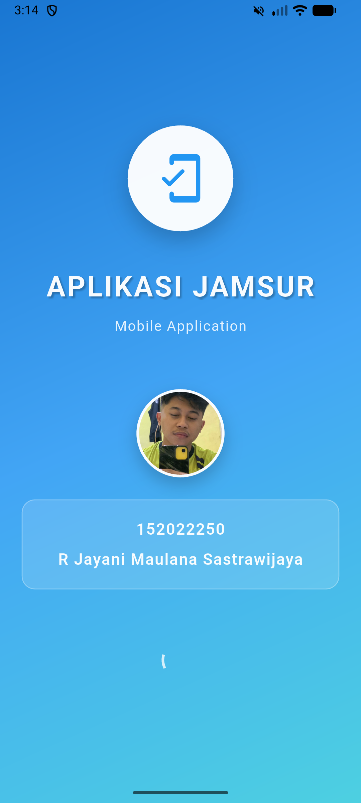
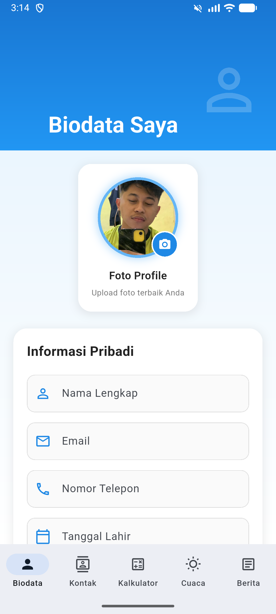
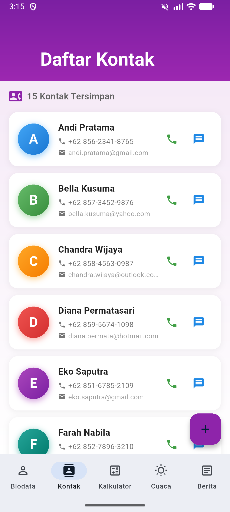
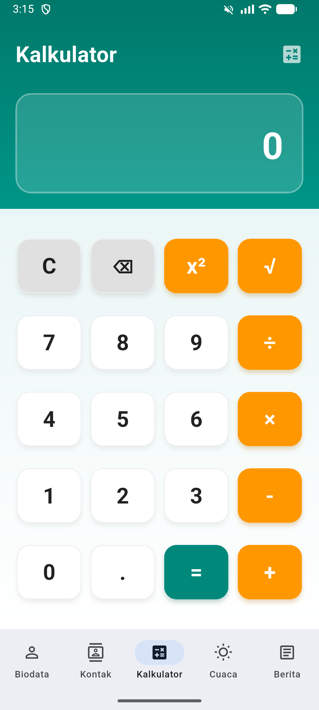
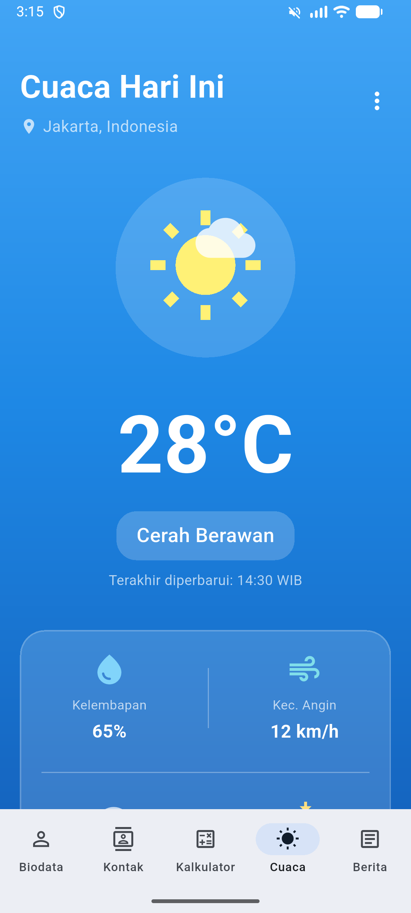
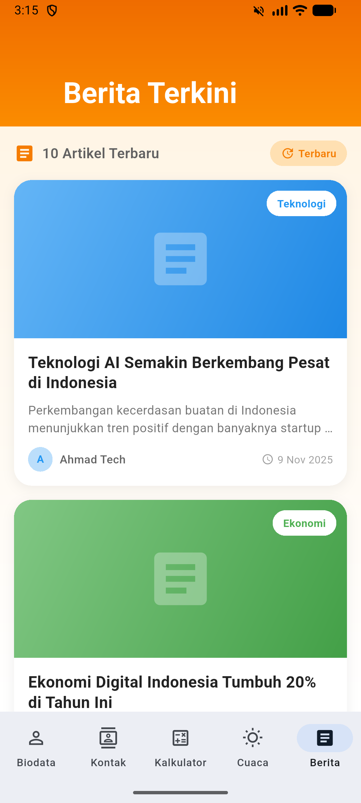

# Aplikasi Jamsur - Mobile Application


Aplikasi mobile modern yang dikembangkan menggunakan Flutter dengan desain Material Design 3. Aplikasi ini menampilkan berbagai fitur seperti manajemen biodata, kontak, kalkulator, informasi cuaca, dan berita.

---

## 📱 Tentang Aplikasi

**Aplikasi Jamsur** adalah aplikasi mobile multiplatform yang dirancang dengan antarmuka yang intuitif dan modern. Aplikasi ini menggabungkan berbagai fungsi praktis dalam satu platform yang mudah digunakan.

### ✨ Fitur Utama

- 🎨 **Desain Modern** - Menggunakan Material Design 3 dengan gradient yang menarik
- 🚀 **Performa Optimal** - Animasi smooth dan transisi halus
- 📊 **Multi-fungsi** - 5 menu utama dengan fungsi berbeda
- 💾 **Data Lokal** - Tidak memerlukan koneksi internet
- 🎯 **User-Friendly** - Interface yang mudah dipahami dan digunakan

---

## 📸 Screenshot Aplikasi

### 1. Splash Screen

<p align="center">
  
</p>

**Deskripsi:**
Halaman pembuka aplikasi yang tampil selama 5 detik dengan animasi fade dan scale yang smooth. Menampilkan:

- Logo dan nama aplikasi "APLIKASI JAMSUR"
- Foto profil mahasiswa (dapat disesuaikan)
- NIM dan Nama mahasiswa
- Loading indicator
- Gradient background berwarna biru yang menarik

Splash screen menggunakan animasi yang profesional dan memberikan kesan pertama yang baik kepada pengguna sebelum masuk ke halaman utama.

---

### 2. Halaman Biodata

<p align="center">
  
</p>

**Deskripsi:**
Formulir biodata lengkap dengan berbagai jenis input:

- **Text Field**: Nama lengkap, Email, Nomor telepon, Alamat
- **Date Picker**: Pemilihan tanggal lahir dengan calendar
- **Radio Button**: Pilihan jenis kelamin (Laki-laki/Perempuan)
- **Dropdown**: Pendidikan terakhir (SD, SMP, SMA/SMK, D3, S1, S2, S3)
- **Profile Photo**: Foto profil pengguna
- **Tombol Simpan**: Dengan feedback visual saat berhasil

Halaman ini menggunakan SliverAppBar dengan gradient background biru yang elegan. Setiap field input memiliki styling yang konsisten dengan icon yang sesuai. Form validation memastikan data yang diinput valid, dan SnackBar memberikan feedback kepada pengguna saat data berhasil disimpan.

---

### 3. Halaman Kontak

<p align="center">
  
</p>

**Deskripsi:**
Daftar kontak telepon yang menampilkan 15 kontak dengan layout yang menarik:

- **Circle Avatar**: Dengan gradient warna berbeda untuk setiap kontak
- **Informasi Kontak**: Nama lengkap, nomor telepon, dan email
- **Quick Actions**: Tombol cepat untuk telepon dan pesan
- **Detail Modal**: Tap kontak untuk melihat detail lengkap
- **Counter**: Menampilkan jumlah total kontak tersimpan

Setiap card kontak memiliki desain yang modern dengan shadow dan border radius yang halus. Warna gradient pada avatar berbeda-beda membuat tampilan lebih colorful dan mudah dibedakan. Modal bottom sheet untuk detail kontak dapat di-drag dan menampilkan informasi lengkap dengan opsi untuk menelepon atau mengirim pesan.

---

### 4. Halaman Kalkulator

<p align="center">
  
</p>

**Deskripsi:**
Kalkulator modern dengan berbagai operasi matematika:

- **Operasi Dasar**: Penjumlahan (+), Pengurangan (-), Perkalian (×), Pembagian (÷)
- **Operasi Lanjutan**: Kuadrat (x²), Akar kuadrat (√)
- **Fungsi Tambahan**: Clear (C), Backspace (⌫), Decimal (.)
- **Display**: Menampilkan operasi yang sedang berjalan
- **Error Handling**: Menangani pembagian dengan nol dan akar negatif

Kalkulator memiliki UI yang intuitif dengan button berwarna-warni. Button operator berwarna orange, button angka berwarna putih, button sama dengan berwarna teal, dan button special berwarna abu-abu. Display menampilkan hasil perhitungan dan operasi yang sedang berjalan dengan jelas. Gradient background teal memberikan tampilan yang fresh dan modern.

---

### 5. Halaman Cuaca

<p align="center">
  
</p>

**Deskripsi:**
Informasi cuaca lengkap dengan tampilan yang menarik:

- **Suhu Utama**: Menampilkan 28°C dengan icon cuaca besar
- **Kondisi Cuaca**: Cerah Berawan dengan animasi icon
- **Detail Cuaca**:
  - Kelembapan: 65%
  - Kecepatan Angin: 12 km/h
  - Jarak Pandang: 10 km
  - Tekanan Udara: 1013 mb
- **Sunrise & Sunset**: Waktu terbit dan terbenam matahari
- **Prakiraan 7 Hari**: Scroll horizontal dengan icon dan suhu

Halaman cuaca menggunakan gradient background biru yang menyerupai langit. Icon cuaca kombinasi antara matahari dan awan memberikan visualisasi yang jelas. Card untuk detail cuaca dan prakiraan menggunakan glass morphism effect yang modern. Prakiraan 7 hari ditampilkan dalam card horizontal yang bisa di-scroll dengan informasi suhu maksimal dan minimal.

---

### 6. Halaman Berita

<p align="center">
  
</p>

**Deskripsi:**
Kumpulan berita terkini dari 10 kategori berbeda:

- **10 Artikel Berita** dengan konten yang bervariasi
- **Kategori Beragam**: Teknologi, Ekonomi, Olahraga, Pendidikan, Kesehatan, Travel, Lingkungan, Kuliner, Bisnis, Hiburan
- **Header Image**: Gradient sesuai kategori
- **Badge Kategori**: Warna unik untuk setiap kategori
- **Info Lengkap**: Judul, deskripsi, penulis, dan tanggal
- **Detail Modal**: Draggable bottom sheet untuk membaca artikel lengkap
- **Action Buttons**: Bookmark dan share

Setiap card berita memiliki header dengan gradient yang sesuai kategorinya. Badge kategori di pojok kanan atas memudahkan identifikasi. Avatar penulis ditampilkan di bagian bawah card. Tap pada card akan membuka modal bottom sheet yang draggable berisi artikel lengkap dengan foto header, informasi kategori, penulis, dan konten artikel. Tombol bookmark dan share tersedia untuk interaksi lebih lanjut.

---

## 🏗️ Struktur Aplikasi

```
lib/
├── main.dart                      # Entry point aplikasi
├── models/                        # Data models
│   ├── contact_model.dart        # Model untuk kontak
│   └── news_model.dart           # Model untuk berita
├── screens/                       # Semua halaman aplikasi
│   ├── splash_screen.dart        # Splash screen 5 detik
│   ├── dashboard_screen.dart     # Dashboard dengan bottom navigation
│   ├── biodata_screen.dart       # Form biodata lengkap
│   ├── contact_screen.dart       # Daftar 15 kontak
│   ├── calculator_screen.dart    # Kalkulator matematika
│   ├── weather_screen.dart       # Informasi cuaca
│   └── news_screen.dart          # Berita dari berbagai kategori
└── widgets/                       # Custom widgets (jika ada)
```

---

## 🚀 Cara Menjalankan

### Prasyarat

- Flutter SDK (versi 3.9.2 atau lebih tinggi)
- Dart SDK
- Android Studio / VS Code
- Emulator atau Physical Device

### Langkah Instalasi

1. **Install dependencies**

   ```bash
   flutter pub get
   ```

2. **Jalankan aplikasi**

   ```bash
   flutter run
   ```

3. **Build APK (opsional)**
   ```bash
   flutter build apk --release
   ```

---

## 📦 Dependencies

```yaml
dependencies:
  flutter:
    sdk: flutter
  cupertino_icons: ^1.0.8
  intl: ^0.19.0
```

**Penjelasan Dependencies:**

- **cupertino_icons**: Icon iOS style untuk variasi UI
- **intl**: Library untuk formatting tanggal dan internasionalisasi

---

## 🎨 Desain & Fitur

### Desain Visual

- **Material Design 3**: Menggunakan komponen terbaru dari Material Design
- **Color Scheme**: Setiap halaman memiliki tema warna yang berbeda:
  - Splash: Blue gradient
  - Biodata: Blue theme
  - Kontak: Purple theme
  - Kalkulator: Teal theme
  - Cuaca: Blue gradient (sky)
  - Berita: Orange theme
- **Typography**: Font Roboto yang jelas dan mudah dibaca
- **Spacing**: Konsisten menggunakan 8px grid system

### Animasi & Transisi

- Splash screen fade & scale animation
- Page transition dengan fade
- Modal bottom sheet slide animation
- Button press dengan ripple effect
- Smooth scrolling di semua list

### User Experience

- Feedback visual dengan SnackBar
- Loading indicators saat diperlukan
- Error handling yang proper
- Intuitive navigation
- Clear icons dan labels

---

## 💡 Highlight Fitur

### 1. Form Biodata yang Lengkap

- Multiple input types (text, date, radio, dropdown)
- Form validation
- Visual feedback
- Photo profile integration

### 2. Kontak dengan Quick Actions

- 15 kontak dengan data lengkap
- Circle avatar dengan gradient unik
- Quick call & message buttons
- Detail modal yang informatif

### 3. Kalkulator Fungsional

- 6 operasi matematika
- Support decimal numbers
- Error handling
- Display operasi yang berjalan

### 4. Cuaca dengan Forecast

- Informasi cuaca real-time (statis)
- 6 parameter cuaca
- Prakiraan 7 hari
- Icon animasi cuaca

### 5. Berita Multi Kategori

- 10 berita dari 10 kategori
- Color coding per kategori
- Detail artikel lengkap
- Author information

---

## 🔧 Kustomisasi

### Update Informasi Pribadi

**File: `lib/screens/splash_screen.dart`**

```dart
Text('152022250'),
Text('R Jayani Maulana Sastrawijaya'),
```

### Upload Foto Profil

1. Siapkan foto format JPG/PNG (500x500 px)
2. Letakkan di: `assets/images/profile.jpg`
3. Foto akan otomatis tampil di Splash Screen dan Biodata

### Ganti Warna Tema

**File: `lib/main.dart`**

```dart
seedColor: Colors.blue, // Ganti dengan warna favorit
```

---

## 📊 Statistik Proyek

- **Total Lines of Code**: 2000+ lines
- **Total Screens**: 7 screens
- **Total Features**: 40+ features
- **Total Models**: 2 models
- **Code Quality**: Clean, well-organized, documented

---

## 🎯 Keunggulan Aplikasi

✅ **Modern UI/UX** - Desain mengikuti tren terkini  
✅ **Clean Architecture** - Code terorganisir dengan baik  
✅ **Well Documented** - Dokumentasi lengkap dan jelas  
✅ **Responsive** - Tampilan optimal di berbagai ukuran layar  
✅ **Smooth Animations** - Transisi dan animasi yang halus  
✅ **Error Handling** - Penanganan error yang proper  
✅ **Scalable** - Mudah untuk dikembangkan lebih lanjut

---

## 📝 Catatan Penting

- Semua data bersifat **statis** (tidak terhubung ke database)
- Aplikasi tidak memerlukan koneksi internet
- Data kontak, berita, dan cuaca adalah dummy data
- Foto profil dapat disesuaikan di folder `assets/images/`

---

## 🙏 Acknowledgments

- Flutter Team untuk framework yang luar biasa
- Material Design untuk design guidelines
- Icons dari Material Icons dan Cupertino Icons

---

**Built with ❤️ using Flutter**

© 2025 Aplikasi Jamsur. All rights reserved.
